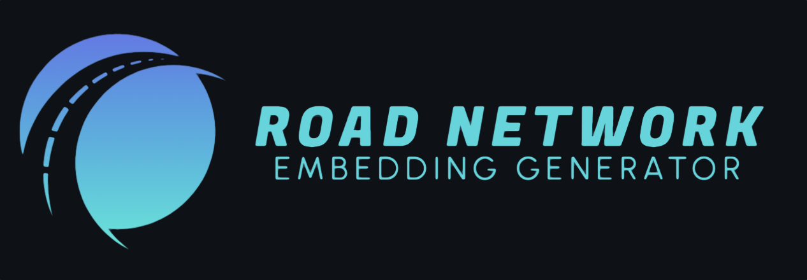

<!-- PROJECT LOGO -->
<!--
<br />
<div align="center">
  <a href="https://github.com/github_username/repo_name">
    
  </a>
</div>
-->


<!-- ABOUT THE PROJECT -->
## About The Project
Code repo from my master thesis from 2022, in which we proposed four novel road segment representation learning models.
The datasets and model states were removed because of storage limits. Furthermore, the implementation of the toast model was removed because of copyright conflicts. 

### Abstract:

Road networks, as the core component of urban transportation, are naturally highly
dynamic, considering traffic patterns and movement behavior induced by traversing
vehicles. Deriving robust road network representations that capture the underlying
dynamics and spatial properties of the road network can directly improve the effectiveness
of downstream tasks, such as travel time or destination predictions. Although, various
approaches in the field of representation learning for road networks have been recently
proposed, they focus on spatial properties without capturing the dynamic characteristics.
In this work, we first propose the Graph Trajectory Convolution (GTC) model, which
incorporates traffic flow information induced by real trajectory data into the aggregation
process. We transfer the idea of modeling traffic flows directly in the learning process to
the DeepWalk architecture and subsequently propose the Trajectory Smoothed DeepWalk
(TSD) model. We further combine the mentioned models with a transformer architecture,
resulting in the Graph Trajectory Network (GTN) model, which additively optimizes the
representations to capture multidimensional trajectory traveling behavior and structural
properties of the road network. We provide extensive experiments including comprehensive
benchmarking, a parameter study, trajectory feature analysis, and an embedding analysis,
showing the superior performance of our GTN model across five different intelligent
transportation systems (ITS) downstream tasks and three different real-world road
networks. The GTN model achieved a 57% higher generalization performance than the
best performing baseline model.
Furthermore, we propose another novel model architecture, namely Temporal Graph
Trajectory Convolution (T-GTC), which incorporates the temporal dependence of road
networks into the road segment representations. This model learns the temporal de-
pendence of the road network by considering dynamic properties, such as driving speed
measurements. The T-GTC model achieved a 30.4% higher generalization performance
over the downstream tasks and a 7.3% better mean absolute error (MAE) on travel time
prediction than the best performing non-temporal baseline, showing that the incorporation
of temporal dynamics significantly boosts the performance on temporal dependent tasks.


### Implemented Road Network Representation Learning Baselines:
- HRNR (https://dl.acm.org/doi/10.1145/3394486.3403043)
- RFN (https://arxiv.org/pdf/2006.09030.pdf)
- SRN2Vec (https://dl.acm.org/doi/10.1145/3424346)
- Toast (https://dl.acm.org/doi/10.1145/3459637.3482293) (Code removed from repo)
- Jointly Contrastive Representation Learning (https://arxiv.org/abs/2209.06389)
- TGCN (https://arxiv.org/abs/1811.05320) (For temporal evaluation)
- Other simple baselines like GAE, Node2Vec, DeepWalk, PCA

All models are written in Python using Pytorch (except for rfn, which uses mxnet)


<!-- GETTING STARTED -->
## Getting Started

WIP

### Prerequisites
To install the required packages we recommend using [Conda](https://docs.conda.io/en/latest/). Our used environment can be easily installed with conda.

### Installation

1. Clone the repo
   ```sh
   git clone https://github.com/...
   ```
2. Install conda environment
   ```sh
   conda config --env --set channel_priority strict
   conda env create -f environment.yml
   ```
3. Activate the environment
   ```sh
   conda activate road-emb
   ```
4. Install [Fast Map Matching](https://fmm-wiki.github.io/docs/installation/) in the environment (Do the steps while in environment) and for MacOS do also [this](https://github.com/cyang-kth/fmm/pull/214)

### Tests
WIP

## Reproduction
WIP

<!-- CONTACT -->
## Contact

1. [Paul Heinemeyer](https://github.com/SwiftPredator) - paul_heinemeyer@outlook.de


